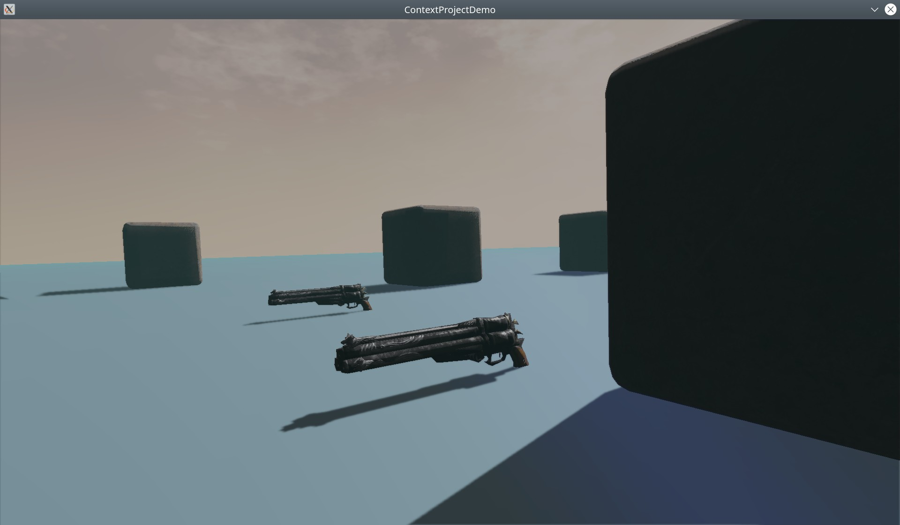
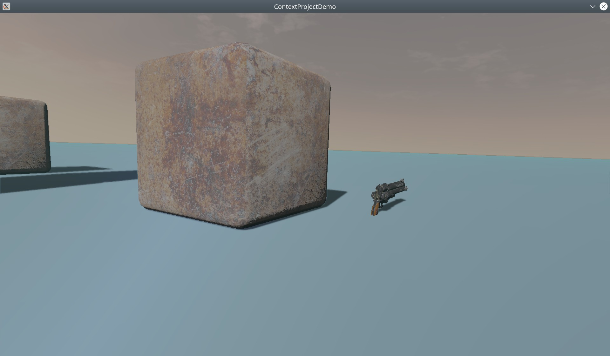

# Context Project

This is prototype of 3D game engine written in C++. I develop it mostly during quarantine.

Implemented features:

- Accurate PBR materials
- PSSM shadows
- Solid body physics
- Loading scenes from XML file
- All dependencies manually compiled and linked statically
- Cross platform build with CMake and Docker (for Linux and Windows) 

It is based on open source:

- Ogre3D https://www.ogre3d.org/
- CEGUI http://cegui.org/
- Bullet Physics SDK http://bulletphysics.com/
- OpenAL Soft https://openal-soft.org/
- SDL https://www.libsdl.org/

----
